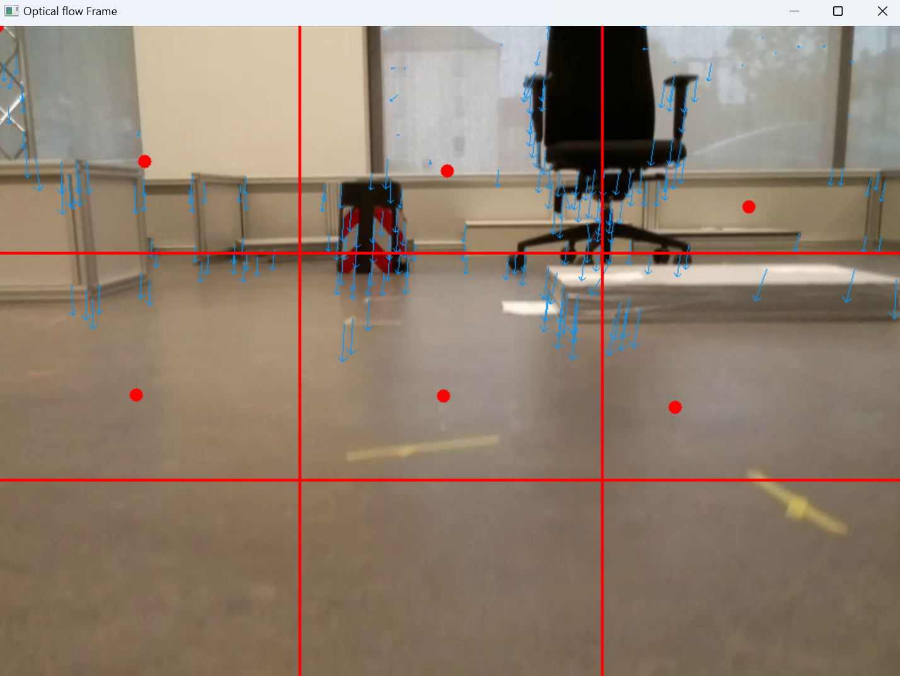
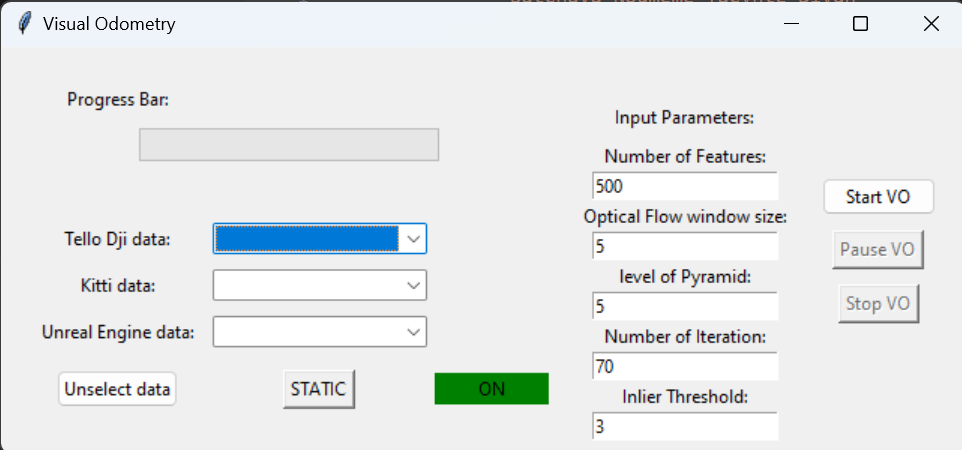
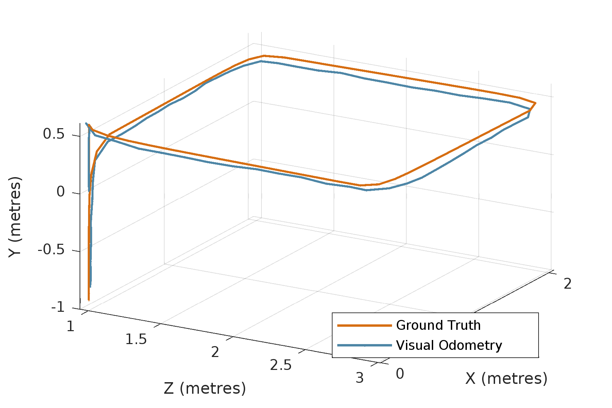
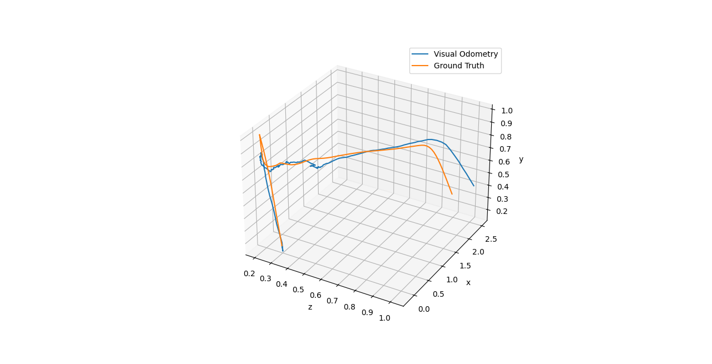
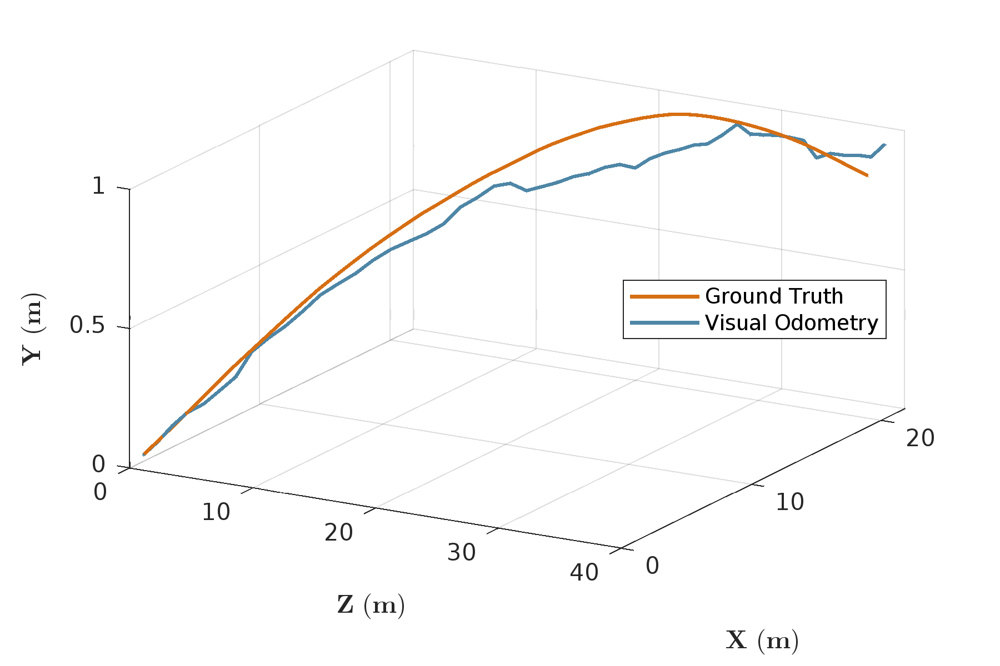

# Monocular (Inertial) Visual Odometry for Drones

This project focuses on developing a monocular (inertial) visual odometry system for drone navigation. The goal is to provide accurate and robust localization capabilities using only visual and inertial sensor data. 
Please Understand that this is an ongoing project and some files may be missing.

## Overview

Monocular (inertial) visual odometry is a technique that combines information from a single camera and inertial sensors to estimate the drone's motion and position. This repository implements a system that leverages these sensors to achieve reliable and precise navigation for drones. At the current state, the project produces a translation error or 1.2% and a rotation error of 0.015°/m on KITTI dataset ana a translation error of 1.8% on the TELLO DJI dron

## Installation

Follow these steps to install and set up the monocular (inertial) visual odometry system:

1. Clone the repository: `git clone https://github.com/Yacynte/Monocular-Visual-Odometry.git`
2. Install dependencies: OpenCV, numpy, matplotlib, tqdm `pip install -r docs/requirements.txt`

[Detailed Installation Guide](./docs/installation.md)

## Usage

To use the monocular (inertial) visual odometry system with your drone, follow these steps:

1. Provide input images and inertial sensor in the Tello, UE or KITTI dataset folder in the same syntax as the other folders.
2. Add the name of your folder in vo_gui.py
3. Run the main script: `vo_gui.py`
4. Configure the system parameters in the `gui`.
5. Start the algorithm.

[Example Usage](./docs/example_mvio.mp4)

## Configuration

Customize the behavior of the system by modifying the parameters in the `gui`. This parameters includes settings such as number of features to track, Quality of optical flow, and filtering parameters.

## Data Format

The monocular (inertial) visual odometry system supports the following data formats:

- Image formats: JPEG, PNG
- Inertial sensor data: CSV, TXT
- Ground truth data: CSV, TXT

<!-- [Input Data Guidelines](./docs/data_format.md) -->

## Results

Here are some visualizations demonstrating the results obtained by the monocular (inertial) visual odometry system:

### Simulated Path

### Tello dji Path

### KITTI dataset path

1. Similated Data from Unreal Engine

- Error, RMSE/meter: translation 1.28%, rotation 0.13°/m

- [Motion Path](./results/tello_square.png)

- [Translation motion](./results/translation_square.png)

- [Rotation motion](./results/rotation_square.png)

- [Error Measurement](./results/Error_square.png)

2. Tello Dataset

- Error, RMSE/meter: translation 5.32%, rotation 0.49°/m

- [Motion Path](./results/tello_line.png)

- [Translation motion](./results/translation_tello.png)

- [Rotation motion](./results/rotation_tello.png)

- [Error Measurement](./results/Error_tello.png)

3. KITTI Data
- Error, RMSE/meter: translation 0.94%, rotation 0.015°/m

- [Motion Path](./results/kitti_path.png)

- [Translation motion](./results/translation_kitti.png)

- [Rotation motion](./results/rotation_kitti.png)

- [Error Measurement](./results/Error_kitti.png)

## License
MIT License

Copyright (c) [2024] [Batchaya Yacynte]

Permission is hereby granted, free of charge, to any person obtaining a copy of this software and associated documentation files (the "Software"), to deal in the Software without restriction, including without limitation the rights to use, copy, modify, merge, publish and/or distribute copies of the Software, and to permit persons to whom the Software is furnished to do so, subject to the following conditions:

The above copyright notice and this permission notice shall be included in all copies or substantial portions of the Software.

THE SOFTWARE IS PROVIDED "AS IS", WITHOUT WARRANTY OF ANY KIND, EXPRESS OR IMPLIED, INCLUDING BUT NOT LIMITED TO THE WARRANTIES OF MERCHANTABILITY, FITNESS FOR A PARTICULAR PURPOSE AND NONINFRINGEMENT. IN NO EVENT SHALL THE AUTHORS OR COPYRIGHT HOLDERS BE LIABLE FOR ANY CLAIM, DAMAGES OR OTHER LIABILITY, WHETHER IN AN ACTION OF CONTRACT, TORT OR OTHERWISE, ARISING FROM, OUT OF OR IN CONNECTION WITH THE SOFTWARE OR THE USE OR OTHER DEALINGS IN THE SOFTWARE.

## Contributing
Contributions are welcome! Feel free to submit issues or pull requests to improve the implementation.