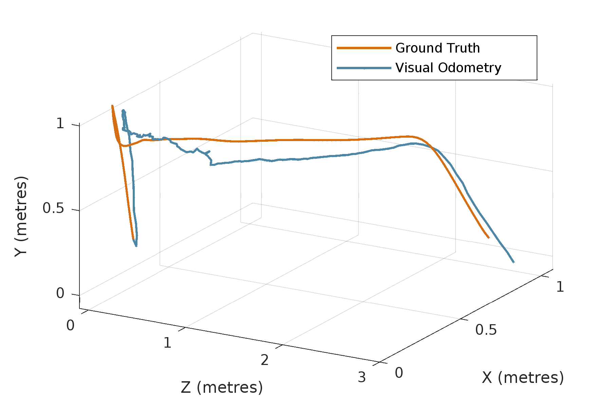

# Monocular (Inertial) Visual Odometry for Drones

This project focuses on developing a monocular (inertial) visual odometry system for drone navigation. The goal is to provide accurate and robust localization capabilities using only visual and inertial sensor data. 
Please Understand that this is an ongoing project and some files may be missing.

## Overview

Monocular (inertial) visual odometry is a technique that combines information from a single camera and inertial sensors to estimate the drone's motion and position. This repository implements a system that leverages these sensors to achieve reliable and precise navigation for drones. At the current state, the project produces a translation error or 1.2% and a rotation error of 0.015°/m on KITTI dataset ana a translation error of 1.8% on the TELLO DJI dron

## Installation

Follow these steps to install and set up the monocular (inertial) visual odometry system:

1. Clone the repository: `git clone https://github.com/Yacynte/Monocular-Visual-Odometry.git`
2. Install dependencies: OpenCV, numpy, matplotlib, tqdm `pip install -r requirements.txt`

[Detailed Installation Guide](./docs/installation.md)

## Usage

To use the monocular (inertial) visual odometry system with your drone, follow these steps:

1. Provide input images and inertial sensor inthe Tello, UE or KITTI dataset folder in the same syntax as the other folders.
2. Add the nade of vour path (your folder) in vo_gui.py
3. Run the main script: `vo_gui.py`
4. Configure the system parameters in the `gui`.

[Example Usage](./docs/example_mvio.mp4)

## Configuration

Customize the behavior of the system by modifying the parameters in the `gui`. This parameters includes settings such as number of features to track, Quality of optical flow, and filtering parameters.

Format: 

## Data Format

The monocular (inertial) visual odometry system supports the following data formats:

- Image formats: JPEG, PNG
- Inertial sensor data: CSV, TXT
- Ground truth data: CSV, TXT

[Input Data Guidelines](./docs/data_format.md)

## Results

Here are some visualizations demonstrating the results obtained by the monocular (inertial) visual odometry system:

Format: 

1. KITTI Dataset
- [Translation motion Result](./results/kitti_curve.png)

- [Rotation motion Result](./results/kitti_rotation1.png)

- Error: translation 1.2%, rotation 0.015°/m
- [Translaation Error of Image 1](./results/kitti_error_model.png)

- [Translaation Error of Image 1](./results/kitti_rotation_err.png)

2. TELLO DJI Data
- [Translation motion Result](./results/tello_line.png)

3. Similated Data from Unreal Engine
- [Translation motion Result](./results/ue_square1.png)

